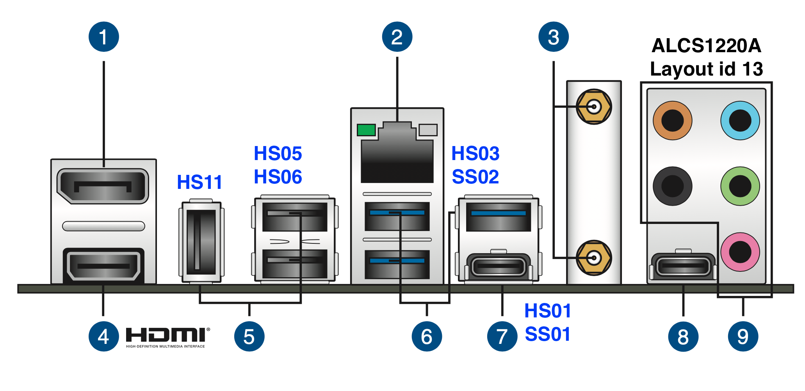
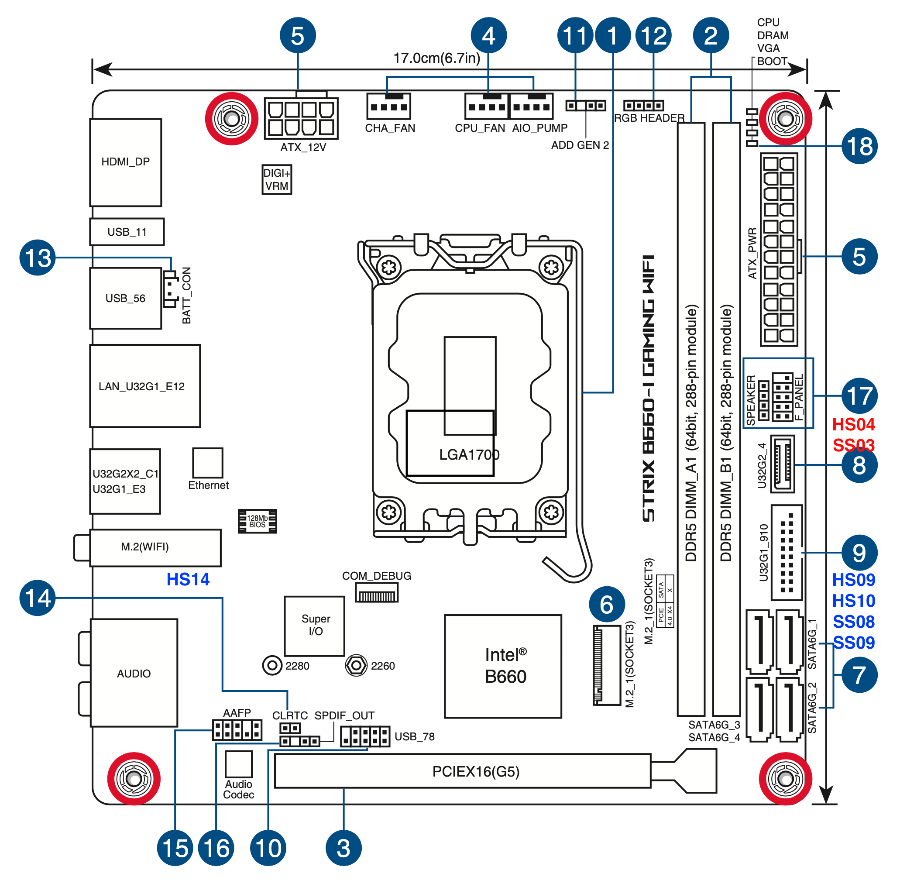

# Hackintosh ASUS ROG Strix B660-I
Opencore Hackintosh settings for ASUS ROG Strix B660-I Gaming WiFi

**Latest working MacOS**: MacOS Ventura 13.0.1  
**Current OpenCore**: 0.8.7 (RELEASE)

## Hardware specs
- ASUS ROG STRIX B660I (BIOS Ver. 2012)
- Intel i5 12400f
- Radeon RX6600XT
- Cruvial DDR5 4800Mhz 32GB (2x16GB)
- Kioxia EXCERA G2 1TB NVMe
- Wifi/BT Fenvi BCM94360NG (replaced with preinstalled intel AX201NGW)

## What works
- macOS Ventura
- Shutdown
- Reboot
- HDMI/DP
- Ethernet
- Wifi/BT
- USB Ports
- Audio
- AirDrop/Handoff/Unlock with Apple Watch... (All Continuity features except Sidecar)
- DRM

## What doesn't work
- DP hotplug  
(DownClocking GPU may solve problem)
- Sleep
- Ocationally crashes while using Zoom or other full screen apps.

## SSDTs
|  | Notes |
| --- | --- |
| [SSDT-AWAC-DISABLE](https://github.com/acidanthera/OpenCorePkg/blob/master/Docs/AcpiSamples/Source/SSDT-AWAC-DISABLE.dsl) | force enable RTC |
| [SSDT-EC-USBX](https://github.com/acidanthera/OpenCorePkg/blob/master/Docs/AcpiSamples/Source/SSDT-EC-USBX.dsl) | AppleUsbPower compatibility table |
| [SSDT-I225V](https://github.com/5T33Z0/OC-Little-Translated/tree/main/01_Adding_missing_Devices_and_enabling_Features) | Intel I225-V Ethernet Controller ([Reference](https://github.com/5T33Z0/Gigabyte-Z490-Vision-G-Hackintosh-OpenCore/blob/main/I225-V_FIX.md#option-1-using-a-ssdt-with-corrected-header-description)) |
| [SSDT-PLUG-ALT](https://github.com/acidanthera/OpenCorePkg/blob/master/Docs/AcpiSamples/Source/SSDT-PLUG-ALT.dsl) | XCPM power management compatibility table |

## Kexts
|  | Ver | Notes |
| --- | --- | --- |
| [AppleALC](https://github.com/acidanthera/AppleALC) | 1.7.6 | AppleHDA patching, allowing support for the majority of on-board sound controllers |
| AppleIntelI210Ethernet | - | [Reference](https://github.com/5T33Z0/Gigabyte-Z490-Vision-G-Hackintosh-OpenCore/blob/main/I225-V_FIX.md#option-1-using-a-ssdt-with-corrected-header-description) |
| [Lilu](https://github.com/acidanthera/Lilu) | 1.6.2 | kext to patch many processes |
| [NVMeFix](https://github.com/acidanthera/NVMeFix) | 1.1.0 | fixing power management and initialization on non-Apple NVMe |
| [RadeonSensor](https://github.com/aluveitie/RadeonSensor) | 0.3.1 | provide GPU temperature |
| [RestricEvents](https://github.com/acidanthera/RestrictEvents) | 1.0.9 | [Fixing MacPro7,1 Memory Errors](https://dortania.github.io/OpenCore-Post-Install/universal/memory.html) |
| [SMCProcessor](https://github.com/acidanthera/VirtualSMC) | 1.3.0 | privide Intel CPU temperature |
| [SMCRadeonGPU](https://github.com/aluveitie/RadeonSensor) | 0.3.1 | provide GPU temperature |
| [SMCSuperIO](https://github.com/acidanthera/VirtualSMC) | 1.3.0 | provide fan speed |
| USBPorts | - | - |
| [VirtualSMC](https://github.com/acidanthera/VirtualSMC) | 1.3.0 | Emulates the SMC chip found on real macs |
| [WhateverGreen](https://github.com/acidanthera/WhateverGreen) | 1.6.2 | graphics patching, DRM fixes, board ID checks, framebuffer fixes |

- [USBInjectAll.kext](https://github.com/daliansky/OS-X-USB-Inject-All/releases)
    - TEMPORALLY
    - for injecting all USB ports.
    - [original USBInjectall](https://github.com/Sniki/OS-X-USB-Inject-All) does not work with Alder Lake chipset.  

## config.plist Setup
- First open ProperTree and take Snapshot.
- Changes from sample.pliset is shown below.

### ACPI
- Noting to do.

### Booter>Quirks
| key | | Comment |
| --- | --- | --- |
| DevirtualiseMmio | true |  |
| EnableWriteUnprotector | false | |
| ProtectUefiServices | true | |
| RebuildAppleMemoryMap | true | |
| ResizeAppleGpuBars | 0 | Set to -1 if Resizable BAR disabled in BIOS setting |
| SetupVirtualMap | false | |
| SyncRuntimePermissions | true | |

### DeviceProperties>Add
- PciRoot(0x0)/Pci(0x1F,0x3)  

| key | Type | Value | Comment |
| --- | --- | --- | --- |
| layout-id | Data | 0D000000 | Applies AppleALC audio injection (layout-id=13) |

```
	<key>PciRoot(0x0)/Pci(0x1F,0x3)</key>
	<dict>
		<key>layout-id</key>
		<data>DQAAAA==</data>
	</dict>
	<key>PciRoot(0x0)/Pci(0x1b,0x0)</key>
	<dict>
		<key>layout-id</key>
		<data>AQAAAA==</data>
	</dict>
```

### Kernel>Emulate
| key | | Comment |
| --- | --- | --- |
| Cpuid1Data | 55060A00000000000000000000000000 | Emulate Comet Lake CPU ([Reference](https://chriswayg.gitbook.io/opencore-visual-beginners-guide/advanced-topics/using-alder-lake#kernel-greater-than-emulate)) |
| Cpuid1Mask | FFFFFFFF000000000000000000000000 | Emulate Comet Lake CPU ([Reference](https://chriswayg.gitbook.io/opencore-visual-beginners-guide/advanced-topics/using-alder-lake#kernel-greater-than-emulate)) |

### Kernel>Quirks
| key | | Comment |
| --- | --- | --- |
| AppleXcpmCfgLock | true | Not needed if CFG-Lock is disabled in the BIOS |
| DisableIoMapper | true | Not needed if VT-D is disabled in the BIOS |
| PanicNoKextDump | true | |
| PowerTimeoutKernelPanic | true | |
| ProvideCurrentCpuInfo | true | For Alderlake CPU ([Reference](https://chriswayg.gitbook.io/opencore-visual-beginners-guide/advanced-topics/using-alder-lake#kernel-greater-than-quirks)) |

### Misc>Boot
| key | | Comment |
| --- | --- | --- |
| HideAuxiliary | true | Press space to show macOS recovery and other auxiliary entries |
| PickerMode | External | GUI bootpicker [Opencore Guide](https://dortania.github.io/OpenCore-Post-Install/cosmetic/gui.html#setting-up-opencore-s-gui)|

### Misc>Debug
| key | | Comment |
| --- | --- | --- |
| AppleDebug| true | |
| ApplePanic | true | |
| DisableWatchDog | true | |
| Target | 3 | |

### Misc>Security
| key | | Comment |
| --- | --- | --- |
| AllowSetDefault | true | |
| BlacklistAppleUpdate | true | |
| ScanPolicy | 0 | |
| SecureBootModel | Default | |
| Vault | Optional | |

### NVRAM>Add>4D1FDA02-38C7-4A6A-9CC6-4BCCA8B30102
| key | Type | Value | Comment |
| --- | --- | --- | --- |
| revcpuname | String | intel® Core™ i5 12400F | Add CPU name |
| revcpu | Number | 1 | Add CPU name |

### NVRAM>Add>7C436110-AB2A-4BBB-A880-FE41995C9F82
| key | Type | Value | Comment |
| --- | --- | --- | --- |
| boot-args | String | agdpmod=pikera e1000=0 | [Opencore Guide](https://dortania.github.io/OpenCore-Install-Guide/config.plist/comet-lake.html#nvram) |
| prev-lang:kbd | Data | 656E2D55533A30 | |

### PlatformInfo>Generic
| key | Type | Value | Comment |
| --- | --- | --- | --- |
| MLB | String | - | Board Serial |
| ROM | Data | - | MAC address |
| SystemProductName | String | MacPro7,1 | SMBIOS Type |
| SystemSerialNumber | String | - | Serial |
| SystemUUID | String | - | SmUUID |

## Mother Board Info
### USB map



### USB port  used
|      | Connector | Device                     | |
| ---- | --------- | -------------------------- | - |
| HS01 | TypeC     | Back panel UBS 3.2 Gen 2x2 | Enabled |
| HS02 | Internal  | AURA LED Contoroller       | Enabled |
| HS03 | Internal  | Internal USB Hub ASM107x   | Enabled |
| HS04 | TypeC with Switch | MB Connector USB 3.2 Gen 2 | |
| HS05 | USB2 | Back panel USB 2.0 | Enabled |
| HS06 | USB2 | Back panel USB 2.0 | Enabled |
| HS07 | | Unknwon | |
| HS08 | | Unknwon | |
| HS09 | USB3 | MB Connector USB 3.2 | Enabled |
| HS10 | USB3 | MB Connector USB 3.2 | Enabled |
| HS11 | USB2 | Back panel USB 2.0 | Enabled |
| HS12 | | Unknown | |
| HS13 | | Unknown | |
| HS14 | Internal | BCM94360NG | Enabled |
| SS01 | TypeC | Back panel UBS 3.2 Gen 2x2 | Enabled | 
| SS02 | Internal | Internal USB Hub ASM107x | Enabled |
| HS03 |  TypeC with Switch | MB Connector USB 3.2 Gen 2 | |
| HS04 | | Unknwon | |
| HS05 | | Unknwon | |
| HS06 | | Unknwon | |
| HS07 | | Unknwon | |
| SS08 | USB3 | MB Connector USB 3.2 | Enabled |
| SS09 | USB3 | MB Connector USB 3.2 | Enabled |
- USB 3.2 Gen 1 Type-C and USB 3.2 Gen 1 (E1, E2 and E3) on back panel is connected to internal USB hub ASM107x.
- Disabled USB 3.2 Gen 2 Front panel connector and USB 2.0 header on MB.

### Audio layout
- Built-in Audio is Realtek ALCS1220A. Layout id is 13.

## BIOS settings
- Advanced > CPU Configuration > Intel (VMX) Virtualization Technology > Enabled (defalut)
- Advanced > CPU Configuration > Active Performance Cores > All (i5 12400f have no E-Cores, unknown)
- Advanced > CPU Configuration > Hyper-Threading > Enabled (defalut)
- Advanced > System Agent (SA) Configuration > VT-d > Enabled (defalut)
- Advanced > System Agent (SA) Configuration > Control Iommu Pre-boot Behavior > Disable IOMMU (default? not sure)
- Advanced > PCI Subsystem Settings > Above 4G Decording > Enabled (defalut)
- Advanced > PCI Subsystem Settings > Re-Size BAR Support > Enabled (defalut)
- Advanced > USB Configuration > Legacy USB Support > Enabled
- Advanced > USB Configuration > XHCI Hand-off > Enabled
- Advanced > Network Stack Configuration > Network Stack > Disabled
- Advanced > USB Configuration > Legacy USB Support > Enabled
- Boot > CSM (Compatibility Support Module) > Launch CSM > Disabled
- Boot > Secure Boot > OS Type > Other OS
- Boot > Secure Boot Mode > Custom
- Boot > Boot Configuration > Fast Boot > Disabled

## To use this EFI
- Serial, Board Serial, SmUUID, and Apple ROM is deleted. Generete them using GenSMBIOS.  
[SMBIOS](https://github.com/corpnewt/GenSMBIOS)  
[OpenCore Install Guide](https://dortania.github.io/OpenCore-Install-Guide/config.plist/#creating-your-config-plist)

## Thanks/Credits
- [Opencore Team](https://dortania.github.io/getting-started/)
